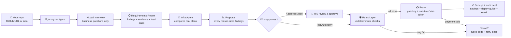
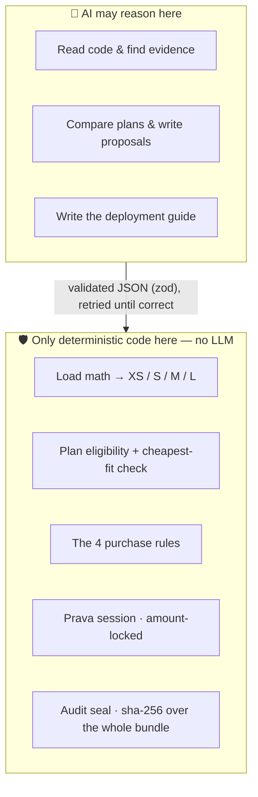

# 🟡 Pay Right

**An AI agent that reads your codebase, proves what infrastructure it needs, and buys it — with money moves guarded by deterministic rules, not vibes.**

Built for the **Agentic Commerce Hackathon** · payments by **[Prava](https://prava.space)** · agents by OpenAI

---

## The problem, in plain words

Before launch, every team buys hosting. But there's **no traffic yet** — so the purchase is a guess.

- **Guess too small** → database fills, server maxes out, app breaks on launch day.
- **Guess too big** → you pay every month for capacity you never use.

The root cause: **nobody turns the actual code into a purchasing decision.** A human skims a pricing page and picks a plan on gut feeling.

And the moment you let an *AI agent* make that purchase instead, a scarier problem appears: **what stops it from hallucinating a plan, overpaying, or buying the wrong thing entirely?**

## Our answer

> **AI reasons. Deterministic code decides. Prava moves the money.**

Pay Right replaces the guess with **evidence**, and replaces trust-in-the-model with **rules the model cannot override**.

1. An **Analyzer Agent** reads the repo file-by-file and produces a requirements report — every finding carries `file:line` evidence and a confidence tag (`derived-from-code` / `inferred` / `user-provided` / `assumption`).
2. Code can't know your traffic — so the agent runs a **Load Interview**: 5–7 business questions a founder can actually answer ("Who is this for?", "Launch-day spike?"). Plain math — not the LLM — converts answers into a load class (XS/S/M/L).
3. An **Infra Agent** compares real plans (Railway, Render, DigitalOcean) and proposes the best fit — every reason must cite finding IDs. A full paper trail from code to purchase.
4. **Four deterministic rules** gate the money. Pure TypeScript, zero AI:

   | Rule | Blocks |
   |---|---|
   | 💰 Spend ceiling | any price above your cap |
   | 🎯 Price match | any drift from the approved amount |
   | 🔒 Category lock | anything that isn't hosting |
   | 🧾 Traceability | reasoning that cites findings which don't exist |

5. **Prava executes** — passkey approval, a one-time Visa network token locked to the exact merchant and amount. The agent physically cannot exceed your limit or skip your key.
6. After the purchase, a third agent writes a **deployment guide** for your exact repo on the exact plan bought, and the receipt — with **savings math** and a **SHA-256 audit seal** — is emailed to you.

## Architecture



### The trust boundary — where AI ends and code begins



Every AI output passes through a **zod contract with a validation-retry loop** — the agent's JSON is rejected and re-prompted until it's structurally perfect. Hallucinated plans, made-up prices, and phantom findings die at this boundary, before any rule even runs.

## When it says no — halts are typed, not vibes

A blocked purchase doesn't throw an error string. It produces an auditable receipt with a **typed halt code** and a **retry class** telling an orchestrator what's legitimate next:

```
CAP_EXCEEDED        → user-approval   (only a human may raise the cap)
PRICE_MISMATCH      → re-quote        (proposal is stale, regenerate)
CATEGORY_VIOLATION  → no-retry        (scope breach is never valid)
TRACEABILITY_BROKEN → re-quote        (defective paper trail)
```

No autonomous retry, ever. And every receipt — approved or halted — is sealed with a **sha-256 hash over the full decision bundle** (report + proposal + decision + rules + receipt), so anyone can prove nothing was edited after the fact.

**Try it live:** drag the spend-cap slider below the plan price and watch the run halt with `CAP_EXCEEDED` — before Prava is ever contacted.

## What a run looks like

Sign in → paste a GitHub URL → watch the agent read the repo live (real file tree, streaming findings) → answer 5 founder questions → review findings with evidence → see the proposal with reasons linked to findings → rules check → passkey → green receipt with savings math, a deployment guide written for *your* repo, and the whole thing in your inbox.

## Run it yourself

```bash
# backend  (needs backend/.env — see backend/API.md)
cd backend && npm install && npm run dev     # http://localhost:4000

# frontend
cd frontend && npm install && npm run dev    # http://localhost:3000
```

Works with any public GitHub repo, a local path, or the bundled `demo-repo`. No SMTP? The email step skips gracefully — everything still shows on the dashboard.

## Dig deeper

| Doc | What's inside |
|---|---|
| [WORKING.md](WORKING.md) | The full design: load math, interview rules, agent tools |
| [backend/API.md](backend/API.md) | The HTTP API the dashboard runs on |
| [backend/README.md](backend/README.md) | Code map — where everything lives |

**Stack:** TypeScript everywhere · OpenAI tool-calling agents · zod contracts · Express · Next.js · Prava sandbox · 30 deterministic tests on the money path.

---

*Pay Right — pre-deployment infrastructure, purchased responsibly.*
