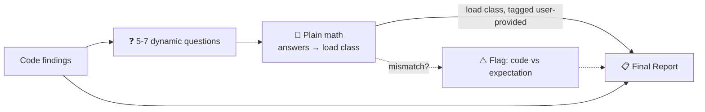
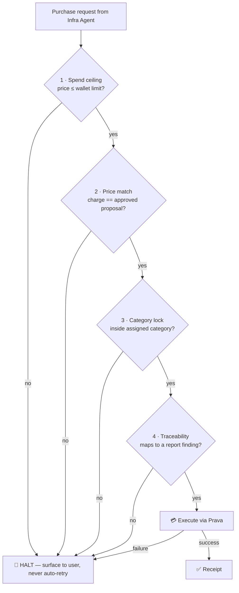
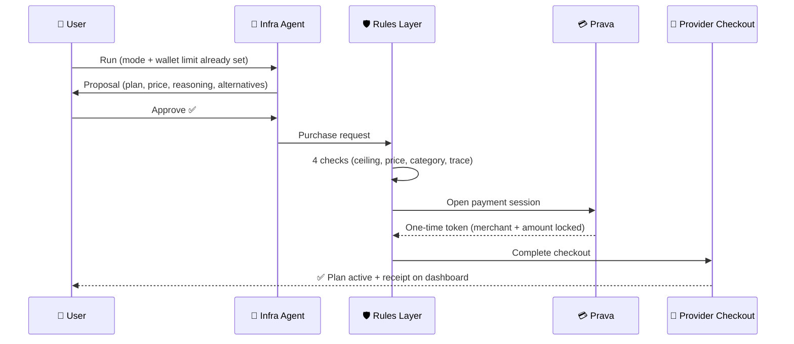

# Pre-Deployment Infrastructure Fit Agent — How It Works

> **One line:** We read your code *before* you deploy, figure out what infrastructure it really needs, and then actually **buy** the right plan for you — safely, through Prava.

---

## 1. The Problem (simple words)

Before launch, every team has to buy hosting, a database plan, and subscriptions.
But there is **no traffic yet** — so the decision is a **guess**.

A guess fails in two ways:

| Failure | What happens |
|---|---|
| **Bought too small** | DB fills up, server maxes out, API quota dies → app breaks, manual upgrade, downtime |
| **Bought too big** | Paying every month for capacity never used |

**Root cause:** nobody reads the actual code and turns it into a purchasing decision. A human guesses. We replace the guess with **evidence**.

---

## 2. The Solution (two agents, one handoff)

- **Analyzer Agent** → reads the codebase, produces a **requirements report** (facts, not guesses).
- **Infra Agent** → reads that report, compares real plans, picks the best one, and **buys it via Prava**.

Between the decision and the money sits a **fixed rules layer** — plain code, not AI — that the agent can never override.

```mermaid
flowchart LR
    A[📁 User's Codebase] --> B[🔍 Analyzer Agent]
    B --> Q[❓ Load Interview<br/>5-7 business questions]
    Q --> C[📋 Requirements Report<br/>code findings + load class]
    B --> C
    C --> D[🧠 Infra Agent]
    D --> E[📊 Proposal<br/>plan + price + reasoning]
    E --> F{Mode?}
    F -->|Approval Mode| G[👤 User approves / rejects]
    F -->|Full Autonomy| H[🛡️ Rules Layer]
    G -->|Approved| H
    H -->|All checks pass| I[💳 Prava Payment]
    I --> J[✅ Receipt on Dashboard]
    H -->|Any check fails| K[🛑 Halt + tell user]
    I -->|Payment fails| K
```



---

## 3. Agent 1 — Analyzer Agent

**Job:** read the repo, output what the code *proves* it needs.

**What it looks for:**

- **Runtime** — Node.js? Python? version?
- **Dependencies** — what they imply (queue lib → needs a broker, video lib → needs RAM/CPU)
- **Database** — type (SQL/NoSQL), schema shape, read-heavy or write-heavy
- **Concurrency class** — CPU-bound or I/O-bound, stateful or stateless
- **Special needs** — websockets, cron jobs, file uploads, background queues

**Every finding gets a provenance tag (only 4, keep it simple):**

| Tag | Meaning |
|---|---|
| `derived-from-code` | Directly visible in the code (strongest) |
| `inferred` | A reasonable conclusion from evidence |
| `user-provided` | The founder's own expectation, from the Load Interview (section 4) |
| `assumption` | A guess — clearly marked as one |

**The honesty rule:** code tells you the *architecture class* a project demands.
Code can **never** tell you real traffic, data growth, or where users live — those are business questions.
That gap is filled by the **Load Interview** (next section). Where load is still unknowable, we prefer **elastic plans over fixed ones**. We never pretend to predict a number we can't know.

**Tools (5 — read-only on code; this agent physically cannot spend money):**
`list_files` · `read_file` · `search_code` · `ask_user` (Load Interview) · `emit_report` (strict JSON schema)

---

## 4. The Load Interview — What Code Can't Tell Us

Code answers **what shape** of infra is needed. Only the founder knows **what size**.
So after reading the code, the Analyzer asks the user **5–7 short business questions** — and turns the answers into a load estimate with plain math.

**Rule A — Business questions only, never technical ones.**
A founder can't answer "how many requests per second?" — but they can answer these. Every question is multiple-choice with real-life anchors:

| Question | Buckets |
|---|---|
| Who is this for? | Internal team / B2B customers / B2C public |
| Users in the first 3 months? | <100 (pilot) / 100–1K / 1K–10K / 10K+ |
| When are they active? | Business hours / all day / spiky events |
| Typical session? | Quick check (1–2 min) / normal (~10 min) / lives in it (hours) |
| Where are users? | One country / one region / global |
| Launch moment planned? | Quiet rollout / launch-day spike / marketing push |

**Rule B — Questions are generated FROM the code findings (dynamic).**
The agent only asks what actually changes the purchase:

- Found **file uploads** → "What do users upload, roughly how big? (photos / documents / videos)"
- Found **websockets** → "How many people connected *live at the same moment*? (team of 10 / classroom of 100 / audience of 1000s)"
- Found **background jobs** → "Must jobs finish fast, or is overnight fine?"
- No uploads in code → that question never appears.

**Rule C — Deterministic math turns answers into a load class, not a fake number.**
Standard capacity formulas run in plain code (no LLM):

```
daily requests = users × requests/user/day     (web app ≈ 10–60)
average RPS    = daily requests ÷ 86,400
concurrent     = ~10–25% of DAU (adjusted by session answer)
peak RPS       = average × peak factor (2× steady / 10×+ launch spike)
```

The output is one of **four load classes** — a range, never "you need 43 RPS":

| Load class | Roughly | Infra meaning |
|---|---|---|
| `XS — pilot` | <100 users | Cheapest tier, cold starts fine |
| `S — early launch` | 100–1K users | Small always-on tier |
| `M — growing` | 1K–10K users | Mid tier + autoscaling ready |
| `L — spiky / scale` | 10K+ or launch spikes | Elastic/autoscale mandatory |

**Rule D — Answers are tagged `user-provided` in the report.**
Not code evidence, not our assumption — the founder's own expectation, honestly labeled. The purchase reasoning can then say:
*"Chose plan X: your code uses websockets (`derived-from-code`, server.js:12) and you expect ~500 live users (`user-provided`, Q3)."*

**Rule E — Answers are cross-checked against the code.**
Founders overestimate. Mismatches are **flagged, not silently obeyed**:

- Says *10K+ users* but code uses **SQLite** → ⚠️ "Your expectation exceeds what your current database supports."
- Says *global audience* but code is single-region → ⚠️ flag it before buying.

**Rule F — The load class sets the *starting tier*; elasticity covers the error.**
User estimates are still guesses — just informed ones. So we size the starting tier from the load class and still prefer **elastic plans**, so being wrong in either direction costs little.



---

## 5. The Handoff — Requirements Report

A **fixed JSON contract**, not free-form AI text. Example shape:

```json
{
  "runtime": { "value": "node-20", "confidence": "derived-from-code", "evidence": "package.json engines" },
  "database": { "type": "postgres", "confidence": "derived-from-code", "evidence": "pg + migrations/" },
  "concurrency": { "class": "io-bound-stateless", "confidence": "inferred" },
  "special_needs": [
    { "need": "websockets", "confidence": "derived-from-code", "evidence": "socket.io in server.js:12" }
  ],
  "load_class": { "value": "S", "confidence": "user-provided", "evidence": "Interview: 100-1K users, launch-day spike expected" },
  "flags": [
    { "warning": "none" }
  ]
}
```

Every finding carries its **evidence** — this becomes the paper trail for every dollar spent later.

---

## 6. Agent 2 — Infra Agent

**Job:** turn the report into the best purchase.

1. Loads a **curated pricing catalog** (2–3 real providers, one category — real data, verified by us).
2. Compares plans against the report's findings: **code findings pick the plan's shape, the load class picks the starting tier**.
3. Produces a **proposal**: chosen plan + price + reasoning + rejected alternatives.
4. **Every reason must cite a finding** — e.g. *"Chose plan X because your code uses websockets (finding #4) and you expect an early-launch audience (load class S, user-provided); plan W rejected because it kills idle connections."*

**Tools (5–6):**
`get_pricing_catalog` · `web_search` (optional) · `create_proposal` · `request_approval` · `execute_purchase` · `report_outcome`

---

## 7. Two Modes (user picks BEFORE the flow runs)

| | Approval Mode | Full Autonomy Mode |
|---|---|---|
| **Who confirms?** | User sees proposal → approve / reject / push back | Nobody — agent buys directly |
| **Safety** | Human + rules layer | Rules layer + wallet limits set upfront |
| **For whom** | Default; new users | Teams that already trust the system |

---

## 8. The Rules Layer (the trust core)

**Not AI. Not a prompt. Plain deterministic code** wrapped around the purchase — there is no code path around it.



Four checks, all must pass, every time — in **both** modes:

1. **Spend ceiling** — never above the user's wallet limit.
2. **Price match** — charge exactly what was approved.
3. **Category lock** — only buy in the assigned service category.
4. **Traceability** — every purchase points to a specific code finding.

If anything fails → **halt and tell the user. Never retry silently.**

---

## 9. The Purchase — Prava

Prava is the payments layer for AI agents:

- User links their Prava account **once** and sets wallet limits.
- At purchase time, the agent gets a **one-time tokenized Visa card** (network token + dynamic CVV).
- The token is locked to the **exact merchant and amount**, expires in minutes.
- **Real card details are never exposed to the AI.**

Because it's a real Visa card, it works at **any checkout that accepts cards** — so we buy directly at the hosting provider's own checkout. Integration: the `prava-pay` skill from [prava-skills](https://github.com/Prava-Payments/prava-skills).



---

## 10. Where the OpenAI Key Fits

The OpenAI API key powers the **brains**, never the **money**:

- **Analyzer Agent** → LLM reads and interprets the code, emits the report (function calling + JSON schema).
- **Infra Agent** → LLM does the comparison and writes the human-readable reasoning.
- **Rules layer & payment** → **zero LLM involvement.** Deterministic code only.

That separation — *AI reasons, code enforces* — is the whole trust story.

---

## 11. Hackathon Scope (what we build, what we skip)

**Build (deep, real):**
- ✅ One language target for the analyzer (Node.js **or** Python backend)
- ✅ One fixed JSON contract between the agents
- ✅ **One** purchase category wired end-to-end through Prava — a real transaction
- ✅ One dashboard screen: *findings → recommendation → decision → receipt*

**Skip (over-engineering traps):**
- ❌ Real multi-agent infrastructure — two sequential LLM calls passing JSON is enough
- ❌ Catching every edge case — a handful of signals drive the purchase
- ❌ Generalized any-vendor comparison engine — curated catalog for 2–3 providers
- ❌ Multi-turn negotiation loop — clear approve/reject already proves trust
- ❌ Numeric confidence scores — three tiers say the same thing
- ❌ Designing for post-launch monitoring — different product, later

**Effort goes where people actually look: report accuracy + reasoning clarity.**

---

## 12. Bottom Line

| Existing tools | Us |
|---|---|
| Vantage/CloudZero: optimize bills **after** you bought | We decide **before** anything is bought |
| Terraform: executes a plan a **human** designed | We **derive** the plan from the code itself |
| Advisors/chatbots: stop at a recommendation | We **complete the purchase** |

**The agent discovers → decides → transacts. Every dollar traces back to a line of the user's own code.**
